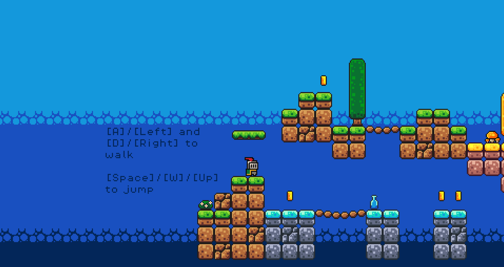

<h1>First Game Godot</h1>

Projeto desenvolvido a partir do vídeo no Youtube "How to make a Video Game - Godot Beginner Tutorial", do canal Brackeys, disponível no link: <a href="https://youtu.be/LOhfqjmasi0">https://youtu.be/LOhfqjmasi0</a>

Nesse jogo você controla um cavaleiro que tem como objetivo chegar até o final do mapa coletando todas as moedas

